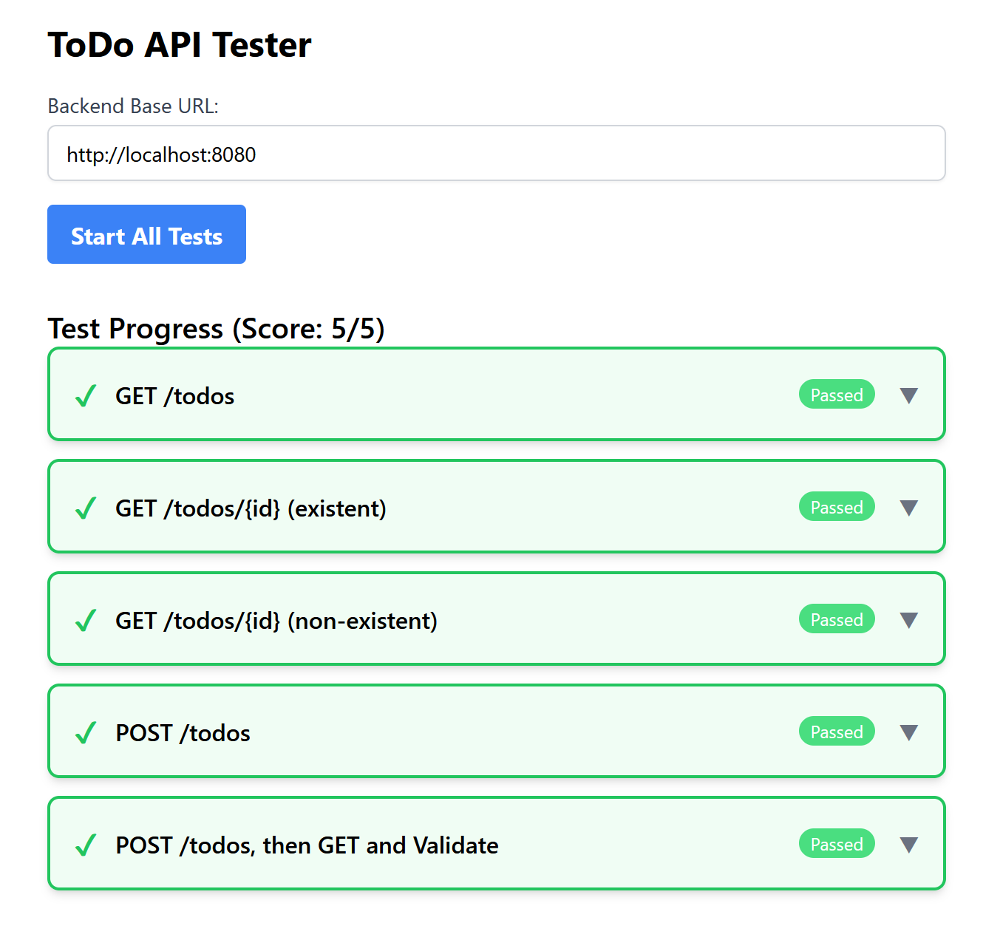

# Backend101

Backend101 是一个用于测试后端 ToDo API 实现的 React 工具。该项目提供了一个用户友好的界面，用于测试后端开发教程或练习中常见的 RESTful API 端点。



## 🧪 功能特点

- **交互式 API 测试** 🗣️：输入后端 URL 并测试一组预定义的 API 端点
- **全面的测试套件** 📚：测试 ToDo API 的常见 CRUD 操作
- **可视化结果展示** 📊：清晰直观的测试结果展示，支持展开查看详细信息
- **顺序测试** ➡️：包含高级测试，通过 POST 创建数据，然后通过 GET 验证
- **故障检测** 🛑：在第一个失败处停止测试，帮助快速识别问题

## 🧪 包含的测试

工具测试以下 API 端点：

1.  **GET /todos** 📄：获取所有待办事项
    -   预期：200 状态码，JSON 数组响应

2.  **GET /todos/{id}** 🆔：通过 ID 获取特定待办事项
    -   预期：200 状态码，包含 id、title 和 completed 字段的 JSON 对象
    -   同时测试不存在的 ID（预期 404）

3.  **POST /todos** ➕：创建新的待办事项
    -   发送：包含 title 和 completed 字段的 JSON
    -   预期：201 状态码，包含创建的待办事项及其新 ID 的 JSON 响应

4.  **POST 然后 GET 验证** ✅：创建待办事项，然后通过 ID 获取它
    -   测试创建和检索之间的数据一致性

## ⚙️ 示例后端

项目在 `sample-backend` 目录中包含一个满足所有测试要求的 FastAPI 后端实现。这既是一个参考实现，也是测试前端的方法。

### 运行示例后端

```bash
cd sample-backend
# 安装依赖（需要 Python 3.8+）
pip install fastapi uvicorn

# 启动服务器
uvicorn main:app --reload
```

后端将在 http://localhost:8000 可用

## 🚀 开始使用

### 前提条件

- Node.js 18+ 和 npm/pnpm/yarn

### 安装

```bash
# 安装依赖
npm install
# 或
pnpm install
# 或
yarn install
```

### 开发

```bash
npm run dev
# 或
pnpm dev
# 或
yarn dev
```

访问 http://localhost:5173 使用应用程序。

## 📖 使用方法

1. 输入后端 API URL（例如 http://localhost:8000）
2. 点击"开始所有测试"
3. 在可展开的卡片中查看结果
4. 点击卡片查看有关测试结果的详细信息

## 🛠️ 使用的技术

- 使用 TypeScript 的 React 18 ⚛️
- 使用 Tailwind CSS 进行样式设计 🎨
- 使用 Vite 进行快速开发和构建 ⚡
- 使用 Fetch API 进行 HTTP 请求 🌐

---

本仓库基于 [reactjs-vite-tailwindcss-boilerplate](https://github.com/joaopaulomoraes/reactjs-vite-tailwindcss-boilerplate) 初始化
